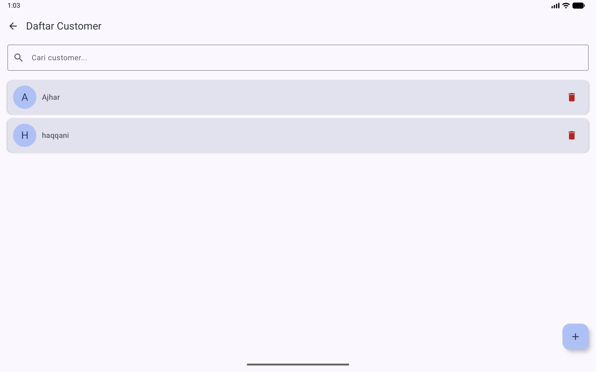
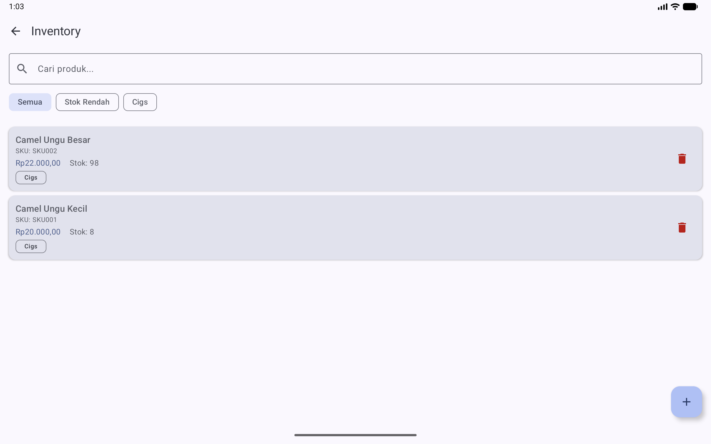
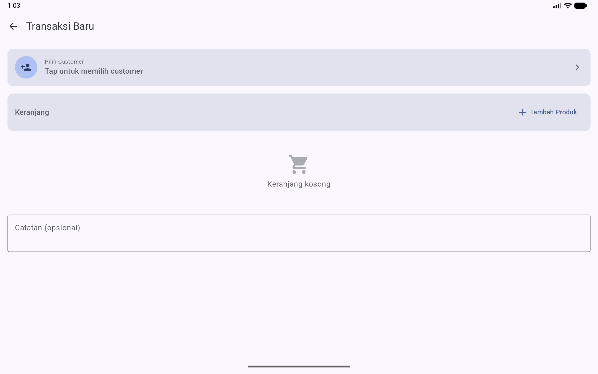
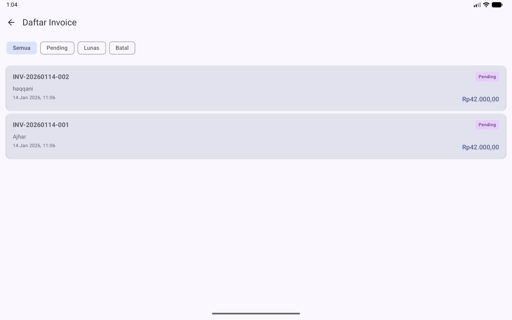
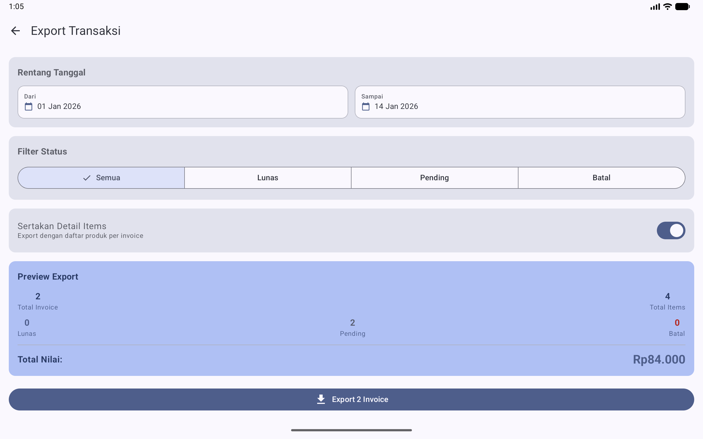
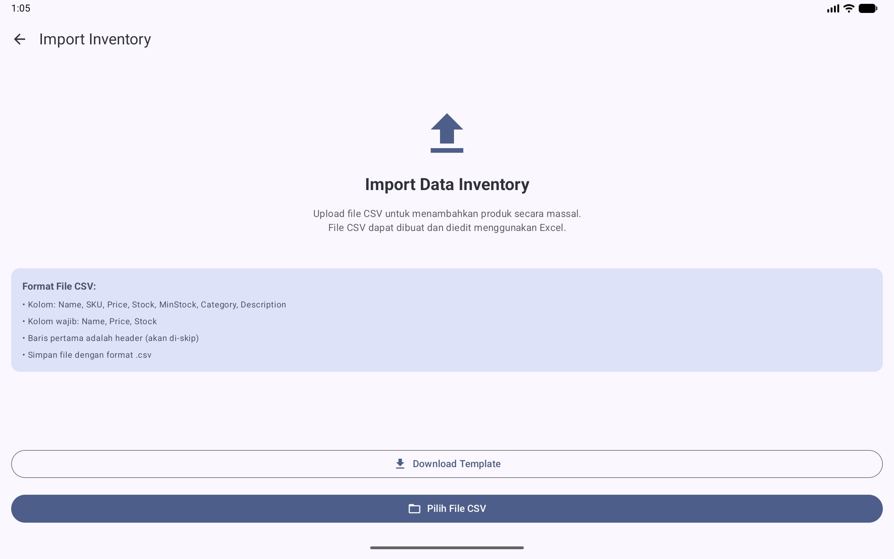
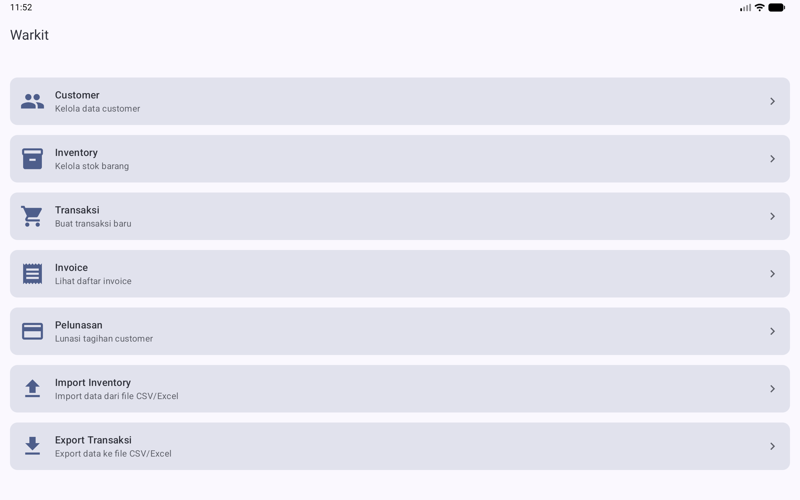

# WarungKita (Warkit) - Manajemen Pembelian, Inventory & Invoice

**WarungKita (Warkit)** adalah aplikasi Android untuk manajemen pembelian customer, kontrol inventory, dan pembuatan invoice untuk usaha mikro (warung/toko). Aplikasi berjalan secara offline (single user) dan mengutamakan keamanan data dengan proteksi PIN.

---

## ✨ Fitur Utama

- **PIN Security**  
  Pengaturan & verifikasi PIN saat membuka aplikasi. Menggunakan EncryptedSharedPreferences (AES-256, lokal device).
- **Customer Management**  
  CRUD customer, search, update dan upload foto customer (kamera/galeri).
  
- **Inventory Management**  
  Manajemen produk/stock, tambah & edit produk, filter kategori, notifikasi stok rendah, dan pencarian.
  
- **Purchase Management**  
  Checkout produk per customer, otomatis hitung total & update stock, generate invoice.
  
- **Invoice Management**  
  List invoice, update status, generate PDF, share/print invoice, filter status, nomor invoice otomatis `INV-YYYYMMDD-XXX`.
  
- **Export/Import Excel (.xlsx)**  
  Ekspor transaksi ke file Excel .xlsx, impor inventory dari template .xlsx, download template, preview sebelum simpan atau ekspor.
  
  
- **Modern UI dengan Jetpack Compose**  
  Navigasi intuitif dan responsif.
  

---

## 🚀 Stack & Teknologi

| Kategori | Teknologi | Versi | 
|----------|-----------|-------|
| **UI** | Jetpack Compose | 2024.x BOM |
| **Architecture** | MVVM + Clean | - |
| **Database** | Room | 2.6.1 |
| **DI** | Hilt | 2.50 |
| **Navigation** | Navigation Compose | 2.7.7 |
| **Security** | EncryptedSharedPreferences | 1.1.0-alpha06 |
| **Camera** | CameraX | 1.3.1 |
| **Image Loading** | Coil | 2.5.0 |
| **PDF** | iText7 | 7.2.5 |
| **Excel** | Fastexcel | 0.20.0 |
| **Barcode (Opsional)** | MLKit | 17.2.0 |
| **Coroutines** | kotlinx-coroutines-android | 1.7.3 |
| **Datetime** | kotlinx-datetime | 0.5.0 |

---

## 🗂️ Struktur Project

```
com.example.warkit/
├── WarkitApplication.kt
├── MainActivity.kt
├── data/
│   ├── local/ (Room, DAO, Entity)
│   └── repository/
├── domain/ (Model, Repo Interface, UseCase)
├── presentation/ (Screen, ViewModel, Navigation)
├── di/ (Hilt Modules)
└── ui/theme/
```

Referensi detail struktur dan package di [notes.md](notes.md).

---

## 🔒 Keamanan (PIN Security)

- Menggunakan `androidx.security:security-crypto` (EncryptedSharedPreferences, AES-256).
- PIN wajib saat membuka app, auto-lock saat keluar/minimize.
- PIN tidak bisa di-reset (hanya dengan clear data device).
- Ganti PIN & forgot PIN (future enhancement).

---

## 📲 Navigasi & Screen

- **Auth:** SetupPinScreen, PinEntryScreen
- **Dashboard:** CustomerList, Inventory, Purchase, InvoiceList, Export, Settings
- **CRUD:** Add/Edit Customer/Produk, Import/Export Excel, Invoice Detail/PDF

---

## 📦 Database Entities

- **Customer**: id, name, phone, email, address, photoPath, createdAt
- **Product**: id, name, sku, price, stock, minStock, category, description, createdAt
- **Invoice**: id, invoiceNumber, customerId, totalAmount, date, status, notes
- **InvoiceItem**: id, invoiceId, productId, quantity, unitPrice, subtotal

---

## ⚙️ Instalasi & Menjalankan

1. **Clone repo:**
    ```bash
    git clone https://github.com/Ajhar-Arion/WarungKita.git
    ```

2. **Buka di Android Studio (Arctic Fox ke atas)**  
   Pastikan JDK & Gradle sudah sesuai berikut:

    | Item | Status | Keterangan |
    |------|--------|------------|
    | JDK | ✅ | OpenJDK 21.0.8 (JetBrains, via Android Studio) |
    | Gradle | ✅ | 8.13 |
    | Kotlin | ✅ | 2.0.21 |

   Jika build error (Java):
    ```powershell
    $env:JAVA_HOME = "C:\Program Files\Android\Android Studio\jbr"
    ```

3. **Sync Gradle dan jalankan pada emulator/device** (Min SDK 23).

---

## 📤 Export / 📥 Import Data

- **Export transaksi ke Excel .xlsx**
- **Import produk dari template .xlsx (bisa edit di Excel)**
- **Preview data sebelum ekspor/impor**

---

## 🔨 Status Development

- Semua fitur utama (Phase 9) sudah selesai.
- Testing & polish (Phase 10) segera menyusul.

**APK size:** ±19MB

---

## 💡 Enhancement Mendatang

- [ ] Ganti PIN di Settings
- [ ] Barcode scanner produk
- [ ] Riwayat transaksi pelanggan
- [ ] Statistik grafik dashboard
- [ ] Data backup/restore & dark mode

---

## 📃 Lisensi

[MIT](LICENSE)

---

## 🙏 Kontribusi

Silakan buat issue atau pull request untuk fitur tambahan, bug, atau saran.

---

## 📞 Kontak

Ajhar Arion  
[Github Profile](https://github.com/Ajhar-Arion)  

---

**Catatan:** Lihat [task_plan.md](task_plan.md) dan [notes.md](notes.md) untuk planning, detail teknis, snippet kode, dan rekomendasi workflow development!
